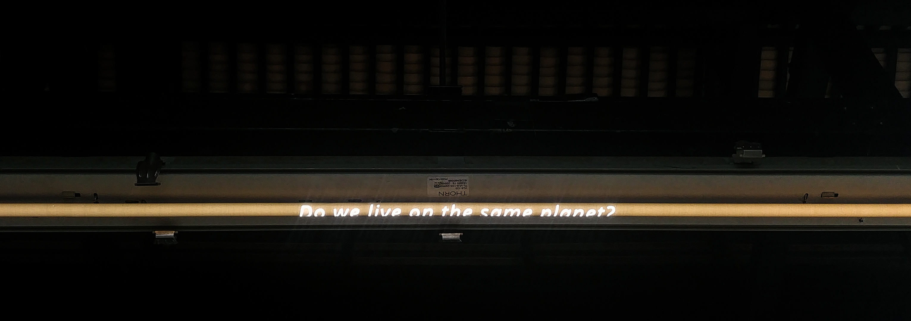
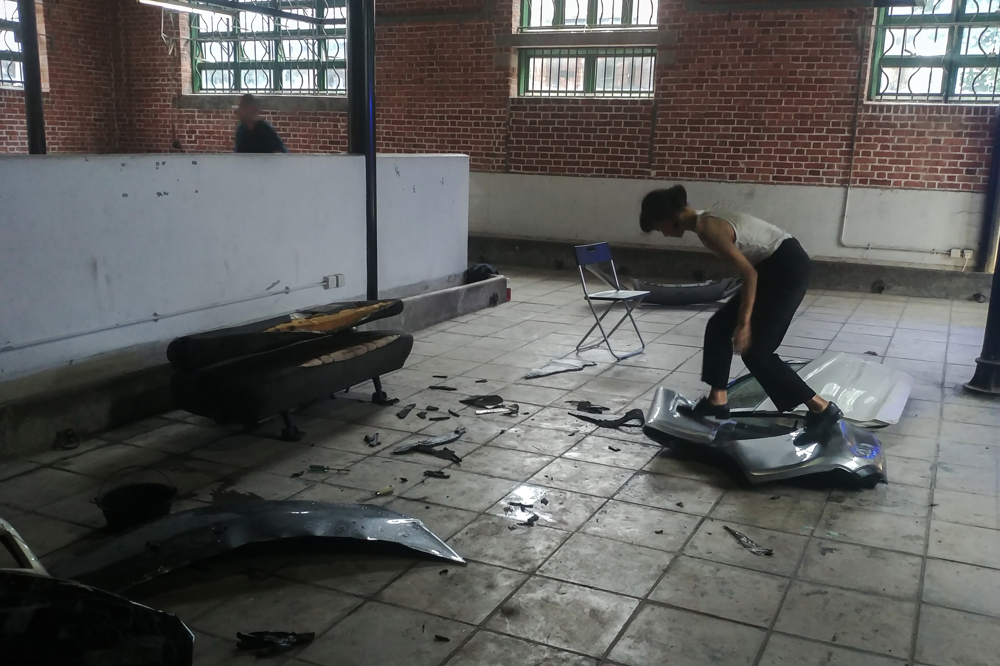
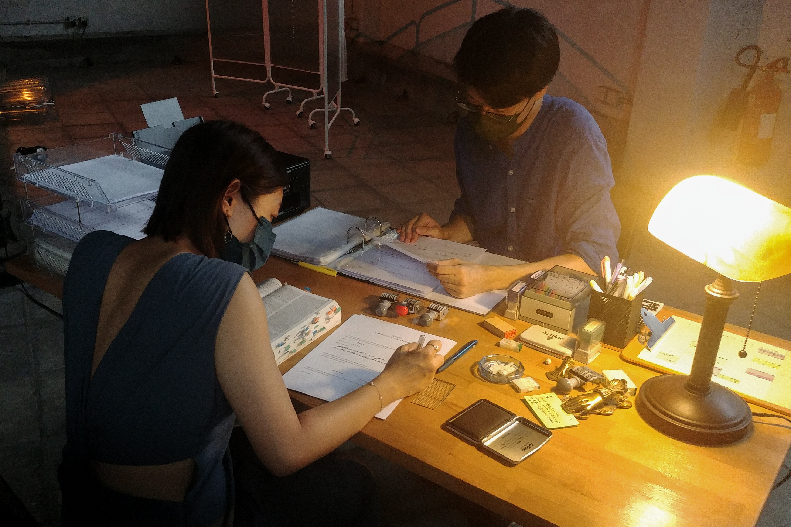
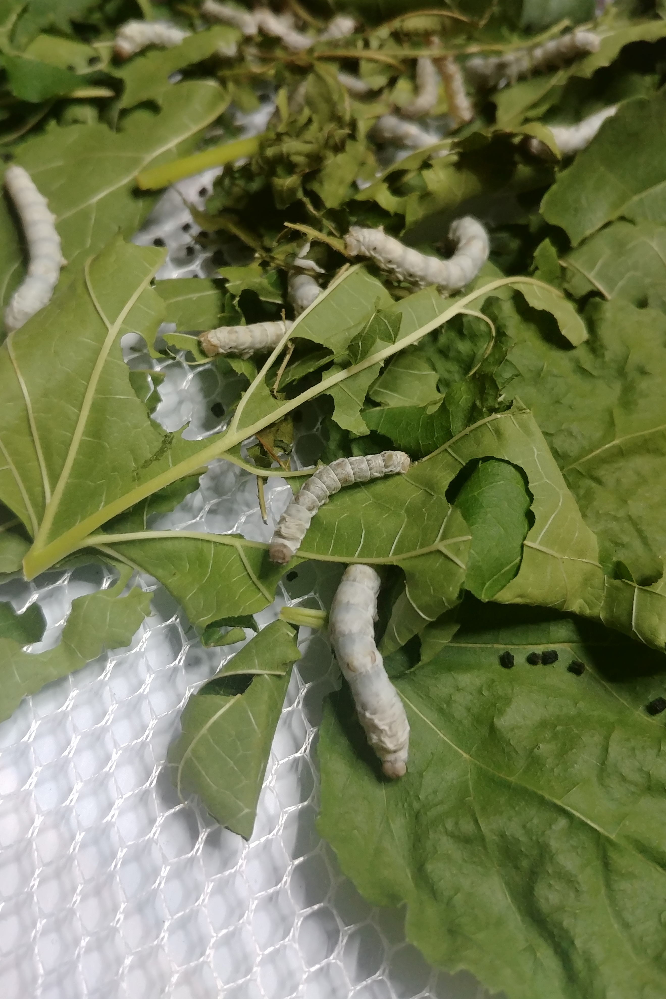
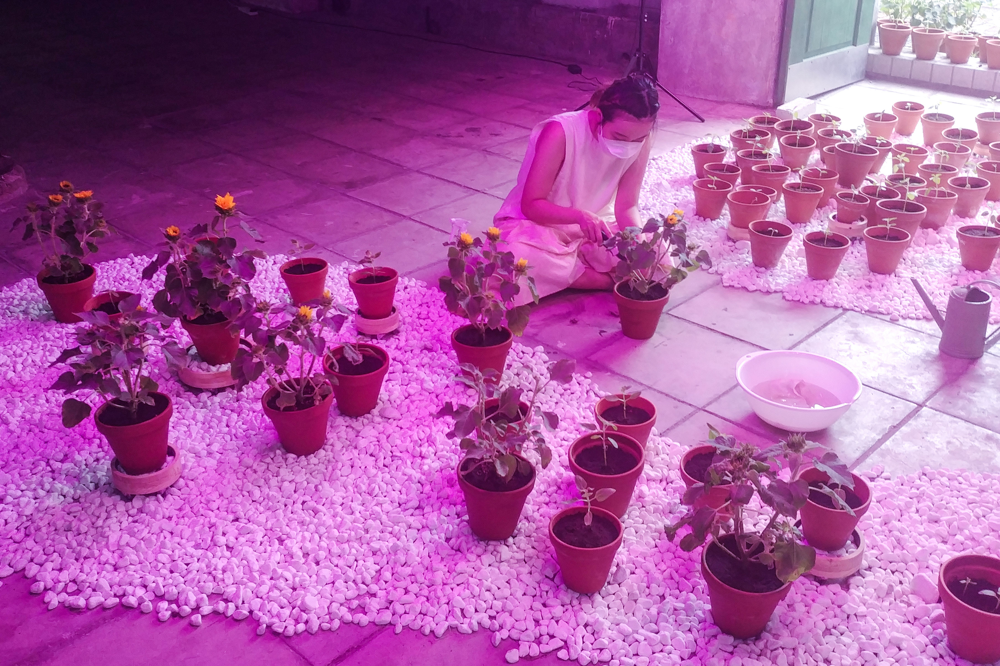

# 演練未來？

展覽 Exhibition :

後人類敘事 — 共存之地

Post-Human Narratives - The Co-existing Land

策展人 Curator：

高穎琳 Kobe KO
藝術家 Artist :

倍帝愛波 Betty Apple

Florence LAM

何倩彤 HO Sin Tung

細倉真弓 HOSOKURA Mayumi
許思樂 HUI Sze Lok Serene

詹昫嵐 Liv TSIM

徐皓霖 TSUI Ho Lam

黃姬雪 WONG Kei Suet Ice
日期 Date :

2021.08.20

## **// 烏托邦是架空現實、過於離地的幻想；敵托邦是萬物崩解、沒有出路的失落。 //**

《著陸（我們交談，然後你忘記了這些言語）》 (許思樂, 2021)

個人而言，我已經不相信烏托邦能夠帶領我們前行，亦厭倦惡托邦的虛無，以及大部份對抗惡托邦的樂觀和無名的毅力。當大部份有關烏托邦的討論，都只投射想像於未來，沒有進行現在式的實踐和改良，而這亦是進入展覽後第一個提問︰〝Do we live on the same planet？〞— 究竟人類有曾處於同一個地方和時間，共同思考關於未來的問題嗎？

《共存之地》的作品使用大量展演性（Performative）元素， Kobe 說這是她與藝術家們不刻意的共識。台灣藝評人張懿文（2021）提出「表演性」是透過不斷重複的操演、透過姿勢和動作形成新的系統和語言 (1) 。表演是「活歷史」，是傳承演者在過去承載的身體記憶以及生活經驗，然後在現場，以進行式展現的現成物，每個時刻都是總和「過去」堆疊而成的「現在」，即興表演（Improvisation）亦然。而這樣現在式、經驗式的反思，正是已往討論未來與烏托邦所缺乏的實踐。

## **與它們共存**

賽伯格（Cyborg）— 即改造人，是烏托邦藍圖的常客，隨之而來便是永不缺值的科技問題，人類似乎仍未能接受身體與金屬結合，亦一直害怕科技會「反客為主」。 Florence Lam 在《疒》中無時限、長時間地以身體和汗水探索汽車殘骸，並與其互動（互動？與其說互動，不如說是她軟柔的身軀，只能受剛硬、不為所動的殘骸限制而活動），嘗試在殘骸上用「人類」最遠古的文字系統，建立屬於「後人類」的文明。「疒」意味生病、臥床，與金屬對話或仍是人們忌諱的活動，能否如 Florence 所說般延伸至療癒，在實然上、心理上需要更多共存的實踐。而《疒》正正以進行式展現了雙方對話的強烈對比，即場示範如何以人類姿態和經驗，對抗後人類在烏 / 惡托邦，甚至現在都需面對的處境，成功與否或能證明人類歴史堆疊至今的知識，是否已足夠讓我們擁有面對以上問題的能力。

《疒》 (Florence Lam, 2021)

## **與我們共存**

Florence 嘗試建立新的語言，而徐皓霖和何倩彤則反思我們對舊有語言的理解。徐皓霖的《甜膩的迭代》引用時裝中不斷輪迴的懷舊未來主義，問懷舊的可能性，及人類在時代中的去向。時間就像那封存旗袍的半透明裝置般無力，無力阻止服裝向後世投射自身盛載的視覺文化，文化將無視時間，一直堆疊和更新。作品亦為觀眾設立「懷舊」的場所，在半透明的屏風下，觀者自然而安然地抱膝閱讀藝術家對懷舊、數碼、過去與未來的闡述，他們甚至成為了作品的一部份，在富現代感的場所中展演同時渴望懹舊與未來的狀態。

語言是人類文明系統的總和，婚姻是保障未來的契約。何倩彤在《共存契約（高階，「遺棄」到「聚焦」）》中與伴侶重新整理語言，是立於現在，鞏固過去，確立未來的演練。在《1984》的未來，人類製造了新語，科技亦漸漸改變人類如何使用語言，但人類準備好面對未來的語言嗎？動畫世界中的「新人類」提出互相理解的重要性，何倩彤亦視〝UNDERSTAND〞為重要的契約，但理解並不是一揮而就，與伴侶的契約得以互相肯定，靠的是她們在過去堆疊的相處和努力。

《共存契約（高階，「遺棄」到「聚焦」）》 (何倩彤, 2021)

## **與牠們共存**

在物質和人類之外，我們還能期待與動植物共存的未來嗎？自工業革命起，人類視人類以外的東西為隨意可用之物，蠶業卻早於公元前已經出現，多年後在詹昫嵐《好乖的勞動者們》中的桑蠶小朋友們，依舊演示牠們與牠們祖先同樣的本能，一直轉變的是人類與牠們的關係。裝置作品為觀眾呈現最能夠想像的「桑蠶未來」，桑蠶演示在權力下「被人類勞動」的狀能，但另一方面， Liv 作為藝術家不可能工業式養蠶，日以繼夜的照料是她選擇與桑蠶共存的方式，她亦一直為桑蠶隊長婷婷打氣！

黃姬雪則在《織綜如生》中展演了她與向日葵的互動 — 重複但耐心的照料，以及互相呵護的感情。黃氏拒絕用舊有記錄日常的方法展示她們共存的經歷，而是將展示的責任和力量都交到向日葵的姿態上，向日葵的「身體」和每個細胞都是證明這一切的最佳媒介，觀眾必需以藝術家同樣細心的觀察才可以在葵花上找到她們共存、共同期待未來的證據。

《好乖的勞動者們》 (詹昫嵐, 2021)

《織綜如生》 (黃姬雪, 2021)

## **演練共存？**

「現在」要靠「過去」堆疊而成，而「未來」亦只能靠「現在」堆疊而成。要想像未來，為未來做好準備，必需於現在實踐。《共存之地》提出人類必需面對的後人類課題，目的不是要得出面對未來的答案，而是要策展人、藝術家、觀眾、甚至動植物在展覽中持續學習與他者共存，而每個進行中的練習將決定我們步向一個怎樣的未來。面對即將抓狂的時代，或許我們更應先捉緊正在共處的我們。

參考 Reference

張懿文. (2021). 舞動展覽：台灣美術館策展的表演轉向. Curatography.  [https://curatography.org/%e8%88%9e%e5%8b%95%e5%b1%95%e8%a6%bd%ef%bc%9a%e5%8f%b0%e7%81%a3%e7%be%8e%e8%a1%93%e9%a4%a8%e4%b8%ad%e7%9a%84%e8%a1%a8%e6%bc%94%e6%80%a7%e7%ad%96%e5%b1%95%e5%ad%b8/.](https://curatography.org/%e8%88%9e%e5%8b%95%e5%b1%95%e8%a6%bd%ef%bc%9a%e5%8f%b0%e7%81%a3%e7%be%8e%e8%a1%93%e9%a4%a8%e4%b8%ad%e7%9a%84%e8%a1%a8%e6%bc%94%e6%80%a7%e7%ad%96%e5%b1%95%e5%ad%b8/.)