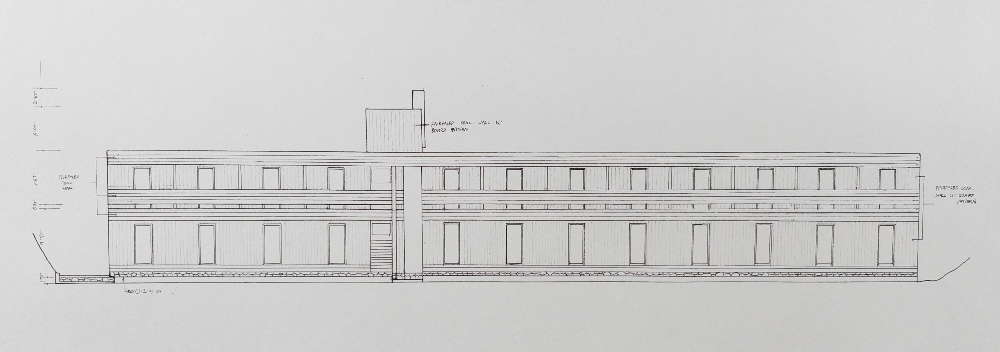
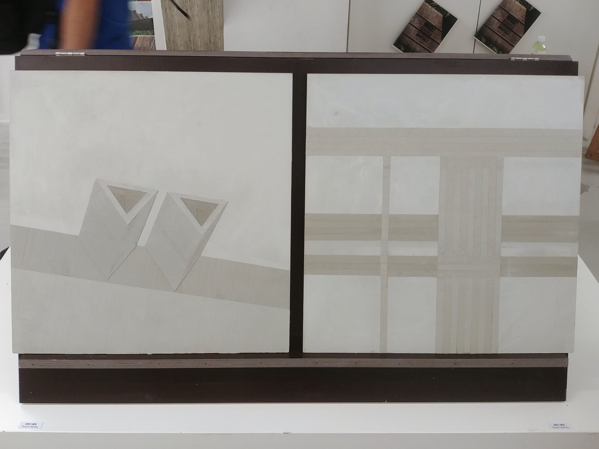
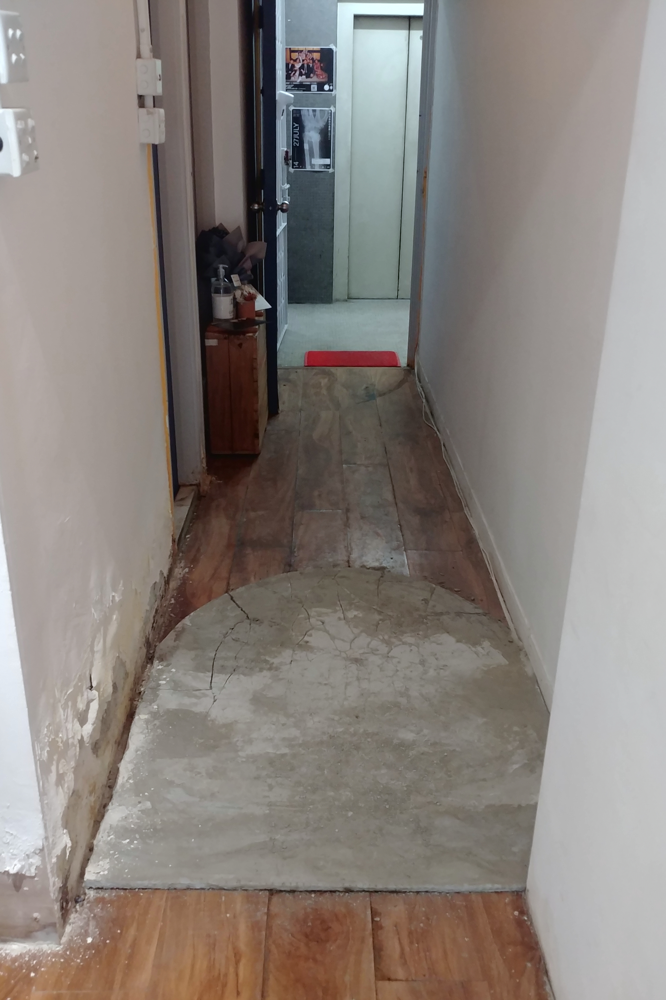
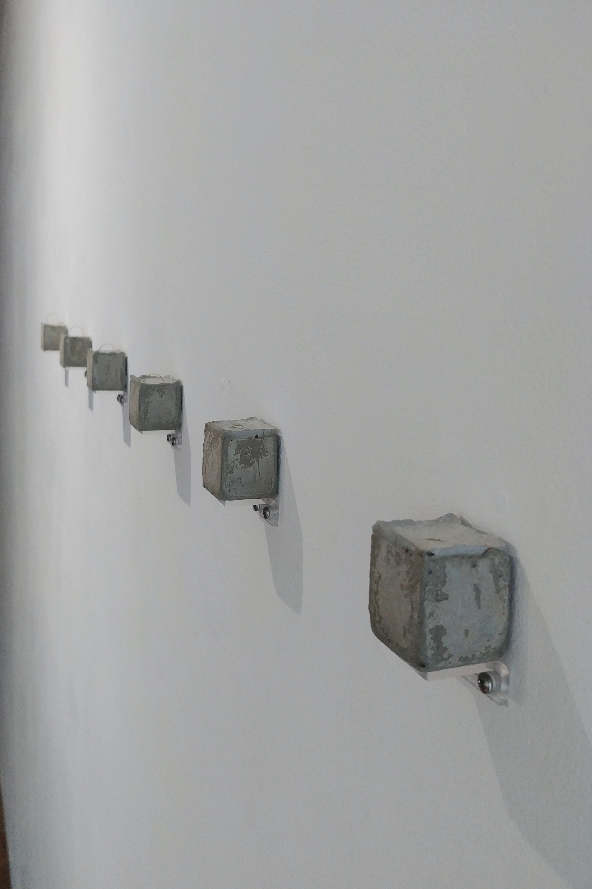
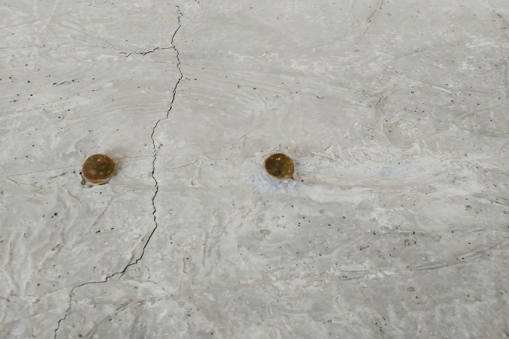
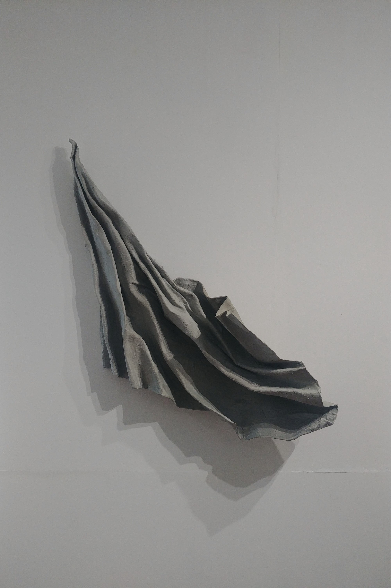
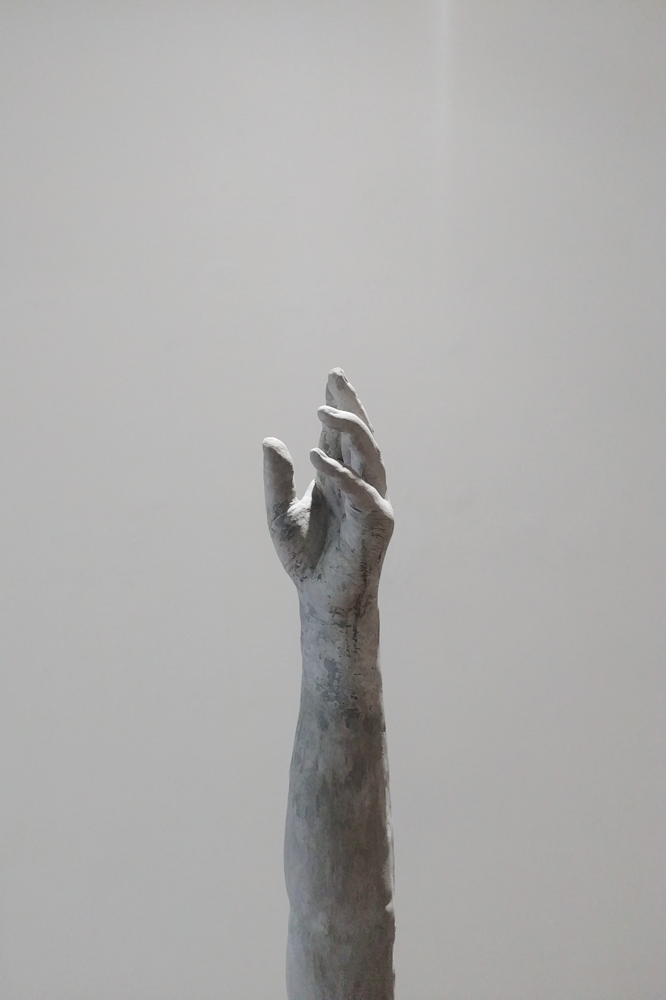

---

title: "cement city"
date: "2021.09.29"
original_url: "https://barrenrockaesthetics.cargo.site/21549598"

---

#cementcity

Exhibition:

Unknown Hong Kong Brutalism

Unknown Brutualism Architecture in Hong Kong

Pacing on cement

Pacing Cement

Artist Artist :

Hong Kong Rough Architecture Research Team

HK Brutualism Architecture Research Team

LEE Sum Yi Sami

Date Date :

2021.09.29

##

Most cities in the world are surrounded by cement. Which city does not rely on it to build its city and industry, but Hong Kong has so much cement that it is nicknamed the "Concrete Forest". Regarding the distance between cement and our lives, "Unknown Hong Kong Brutalism" (hereinafter referred to as "Wei") and "Pace on Concrete" (hereinafter referred to as "Pace") coincidentally and in discordant angles explain our close but distant relationship with cement, as well as the things that cement contains.

## **Neighboring but unfamiliar cement**

In the post-war modern architecture that emphasizes speed and convenience, cement is the most popular material, and it has even become the spokesperson of Brutalism. Among the fastest cities in the world, Hong Kong has a series of outstanding modern buildings. Rough architecture has always been alive in our city, but we have turned a blind eye. If behemoths are really closely related to our cities, why can’t we “see” them in our daily lives?

****
Strictly speaking, Brutalism explores the most primitive (as found) and structural side of architecture. Cement is a medium for expressing structure, and architectural structures satisfy aesthetic pursuits on the one hand, and shape spatial experience on the other. Among the many buildings studied in "Wei", except for a few buildings at the Chinese University that everyone may have the opportunity to enter, most of them may not have the opportunity to travel and are difficult to experience. "Wei" attempts to use architectural drawings, photography and 2.5D cement paintings to show the beauty of the structure, and uses simple ladder-shaped devices to show how the structure shapes the spatial experience. However, it is still, of course, different from the vision of the scene and the city, and it is difficult for the public to connect them with life. In fact, our city does not give us space to understand architecture. Externally, we do not have enough visual space to see the beauty of architecture; internally, redundant regulations and restrictions hinder our right to experience space. What's the point of building something that can't be used?

St. Stephen's College (cast, 2021)

The rough buildings in the city have gradually become strange neighbors, and the purpose of doing research is to make them visible again. Bob, the founder of "Wei", mentioned in the conversation that the reason why we need to discuss brutal architecture now is because most buildings have a "life span". The emphasis on Hong Kong's brutalist architecture now is to preserve them in the future. The cement paintings in "Wei" imitate the structures of Hong Kong's rough buildings, which may be the only way we can touch and feel them. The "Wei" team takes the initiative to understand these "cement", open up the opportunity to appreciate Hong Kong's rough architecture, discuss and popularize their beauty, which is a responsibility based on professionalism, history and conservation.

## **Living on cement**

In comparison, Li Xinyi’s approach to understanding cement is very straightforward. In fact, we don’t really know much about cement, but as the exhibition introduction says: “We walk on it every day and live in it.” In our daily experience, we are very close to cement, and this is also an opportunity for most people to touch the city.

The first step into the exhibition is to step on the cement board at the door. The artist tries to evoke the audience's memory of cement through touch. The steps are as usual, but the cement responds with a fragile voice. The unusual touch not only confirms our unfamiliarity with cement, but also kicks off what Li Xinyi wants to say in the exhibition. "Pace" uses cement as an introduction, adding poetic language and physical experience to form our relationship with cement.

"Like Forever..." (Li Xinyi, 2021)

"Pace" presents our impression of cement through works. The cement in "Like an Island That Can Never Be Reached" is resistant and stubborn even after exhaustion; the cement in "Like a Cloth Hanging from the Surface" is malleable but not soft; the cement in "Like Forever..." is permanent and irreversible. The artist pinned the feelings of these two years on these qualities, about the unfinished road, about the unreachable end, about roughness, memory and eternal promises. In the past two years, there have been many more concrete floors in the city, violently replacing the old landscape. Facing cement, we are so unfamiliar and powerless.

Starting from the pace of "Like Familiarity and Not Familiarity", to "Like Cloth Hanging on the Face" trying to shape cement, and then "Like You in the Air" using cement to "replace" the body as a monument of memory, and finally ending with "Like End" as a summary of the entire interpretation journey. The artist uses touch, emotion and imagination to understand the state of life on concrete. Sometimes, these interpretations also respond to the republican sentiments of Hong Kong people.

"Like an Island That Can Never Be Reached" (Li Xinyi, 2021)

## **Understand cement? Know the city? **

Cement is everywhere in cities, but we don’t know why cement appears in our bodies in this state. Suddenly, they become walls, deciding that we can only go here and not there; suddenly, they represent this place, changing the texture and content of our lives. Cement has become the language for understanding the city. The significance of understanding cement is to understand why life is built on cement.

"Wei" and "Pace" are obviously visually discordant, one large and one small, but they both reflect the decoupling of life from the city. In response to this, "Wei" reviews and records the unseen side of the city to prepare for future changes in the city; "Pai" demonstrates starting from oneself and understanding the texture of the city and life within reach. The counter-reading of "Wei" and "Pai" not only looks at the current situation from the perspective of disharmony, but also puts forward the care and sensitivity we should have towards life, our surroundings, and the city. "Wei" and "Pai" are rational on one side and emotional on the other. Between the two ends of the spectrum, there is still a lot of space waiting for us to recognize and understand the things surrounding us.

"Like a hanging cloth" (Li Xinyi, 2021)

"Like You in the Air" (Li Xinyi, 2021)