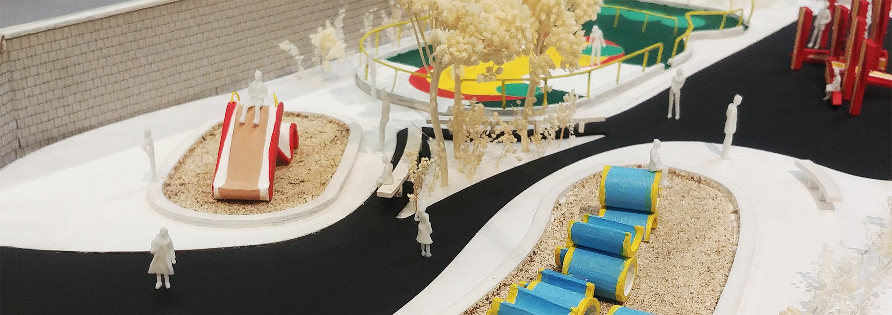
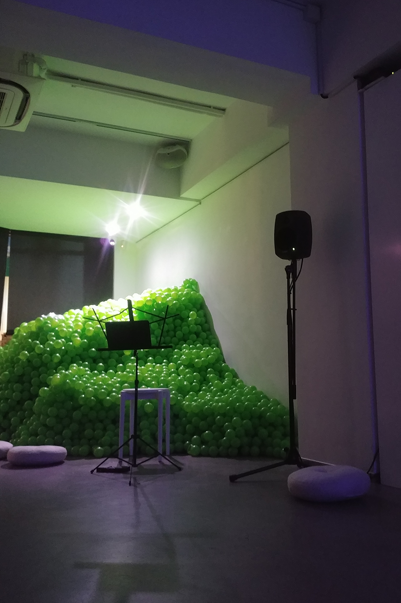
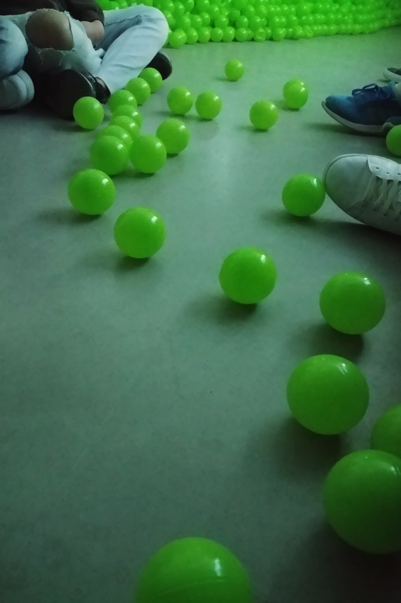
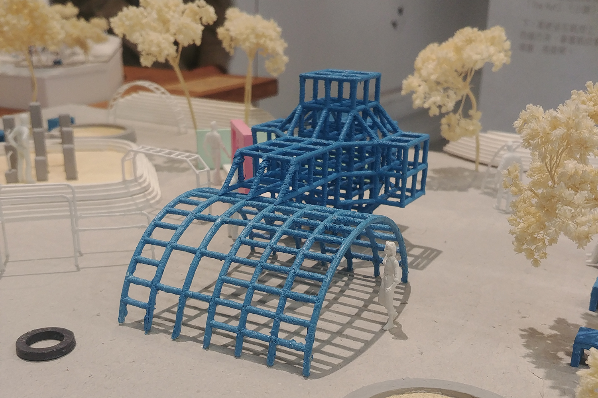
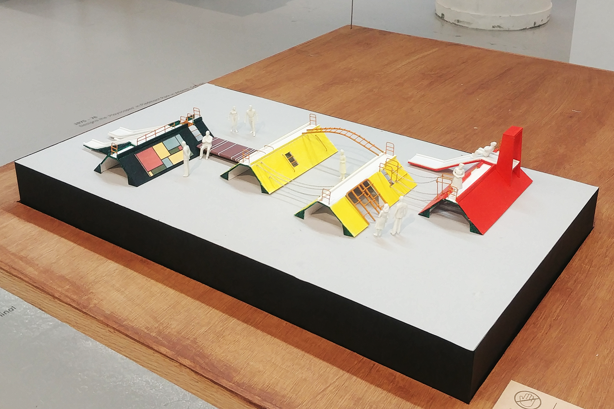
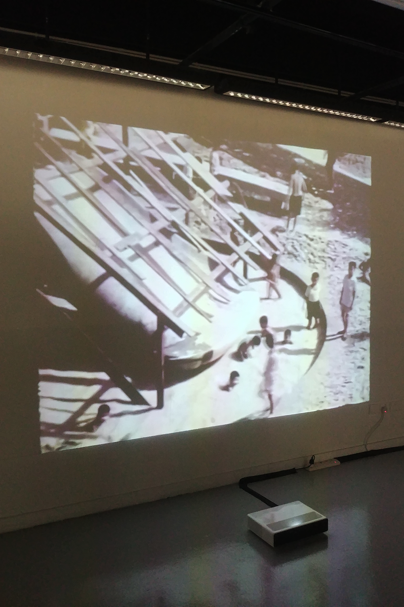

# 遊樂場記，2021

展覽 Exhibition :
antiplayground

我們的抽象遊戲地景

Our Abstract Playscapes
創作人／策劃人 Creator/ Curator :
趙朗天 Alain CHIU

何映宜 HO Ying Yi

樊樂怡 Helen FAN

日期 Date :

2022.01.04

##

兩年間，城市空間盡失，疫情後更甚，尤其是遊玩空間，對於兒童和家長來說都是一大挑戰。在疫情下回顧遊玩空間的重要性在於了解我們何以在困境下成長。智樂兒童遊樂協會與拓展公共空間早前發佈了他們於疫情期間研究兒童遊戲的成果，希望重新強調遊玩空間應是一個城市的基礎設施。

// Man is only fully human when he plays! // (Schiller, F., & Snell, R., 2004).

## **在「非空間」遊玩！**

座落於鬧市中的 antiplayground 同樣視遊玩為生活必需，空間沒有了，他們探索「非空間」，表明他們必需「玩耍」的決心。在《演／講 哲學》中，團隊把議題建基於「遊戲」與「框架」的矛盾之間 – 遊戲是關於想像力、關於開放思考、關於離開框架並投向未來的行動。《演／講 哲學》一開始由鹽叔（好青年荼毒室）提出關於遊戲重要性的理論框架，而表演（作為藝術手段）則在中段介入，將關於開放框架的理論框架以玩具聲效和混音打破，加入膠球，漸進地成為一個遊戲的邀請，更打開講者、藝術家與觀眾之間的權力關係。

antiplayground 一方面提出遊玩的重要性，另一方亦與 Cong Quartet 合作，展示他們如何想像「非空間」的遊玩模式。演出以膠球聲效作引子，繼而進入四重奏，有限的樂句重覆，卻以不同形態展現 – 聲部交替、撞音、混音，都在建構和破壞音樂所製造的空間，不斷定義和探索「非空間」的組成過程。最後在膠球的邀請過後，樂手毅然離去。聲音抽象，旋律卻具體，觀眾有足夠素材在腦海中隨意地具像出遊樂場，亦有權任性地把它毀滅。這種處於思想內、能自出自入、卻在時空上與他人同步的空間，相信便是 antiplayground 認為我們需要的「非遊樂場」。

antiplayground 證明我們的遊玩能力並沒有過期，足以抗衡「遊樂場消失」，我們只是在某時失去了動力， antiplayground 在我們經過社會框架的洗禮後，用理性把它喚醒。恰巧，同期展出的「我們的抽象遊戲地景」向時間的另一方研究，重新認識我們在「成為齒輪」前已經出現、並影響我們遊玩習慣的場所。

****

antiplayground (2021)

antiplayground (2021)

## **抽象與好奇**

策劃人 Helen 靠著對一張石籬遊樂場舊照的好奇，回溯遊樂場還沒有「消失」的日子，「我們的抽象遊戲地景」便是這「好奇」的結果。香港遊樂場在被公式化的組件佔領前，石籬原來如斯美麗的雕塑式遊樂場，這是藝術家野口勇在中西方也要用盡九牛二虎之力才能成就的遊戲語言﹐石籬遊樂場可說是香港遊樂場發展史中的一顆重要遺珠。計劃以石籬遊樂場為起點，延伸向更多優秀卻被忽略的遊樂場。展覽除了展示石籬遊樂場及其餘數個抽象遊戲地景之外，亦舖展了世界遊樂場發展史中，多條重要的時間線和多個著名抽象地貌，眼利的觀眾可以在當中發現它們之間的對話，以及香港遊樂場與國際舞台的微妙關係，欣賞我們的遊樂場曾以這樣前衛的姿態面向世界。

石籬遊樂場的紀錄片是展覽中另一珍藏，片段相信由設計師 Paul Selinger 自行拍攝，因為 Helen 的研究而在多年後發現並公開。片段除了記錄當年香港建造業的巧手，更引人入勝的是在遊樂場未完成便已經在玩耍的孩童，正好體現自由遊戲（Free Play）及其創造力。遊戲是兒童的日常，是他們了解世界、學習與人建立關係的重要途徑，自由遊戲受 Montessori、Waldorf 等早期兒童教育理論高度重視，其重點在於提供無限可能的遊戲，培養兒童的創造力。遊樂場是為遊戲而生的場所，抽象語言正能讓遊戲者自行詮釋並創造。討論抽象遊戲地景，除了反思現有的自由地貌，更關懷我們期盼擁有（或保有）的思維模式。

石籬遊樂場的紀錄片

## **遊玩作為權利與實踐**

有人會說遊戲是「未發展的藝術行為」（”undeveloped art production”）（Luostarinen, N., & Hautio, M., 2019），它們的相同之處包括展現自由和創造力的能力。 antiplayground 的藝術語言，與「香港抽象遊戲地景」的研究任務顯然不一，兩者能互相呼應，不單是因為他們有共同的媒介－遊樂場，亦因為遊玩和藝術實踐正共同地關心創意實踐，及其創造空間與事物的能力。antiplayground 提醒我們在亂世可創造我們自己的空間，而這能力需要自由的遊樂場培養；創造力是我們應該擁有的，享有自由的遊樂場是我們基本的權利。

P.S. 如你對如何設計遊戲感到好奇，遊戲設計師 Cas Holman 有在 Netflix 的 Abstract: The Art of Design 中談及她設計自由遊戲的心得，近日 M+ 亦有利用她設計的 Imagination Playground 為親子舉辦工作坊。你或可以留意智樂兒童遊樂協會，他們有定時舉辦課程，教授營造自由遊戲的技巧。

參考 Reference

Luostarinen, N., & Hautio, M. (2019). Play(e)scapes: Stimulation of Adult Play through Art-based Action. International Journal of New Media, Technology & the Arts, 14(3), 25–52.  [https://doi.org/10.18848/2326-9987/CGP/v14i03/25-52](https://doi.org/10.18848/2326-9987/CGP/v14i03/25-52)

Schiller, F., & Snell, R. (2004). On the aesthetic education of man. Courier Corporation.