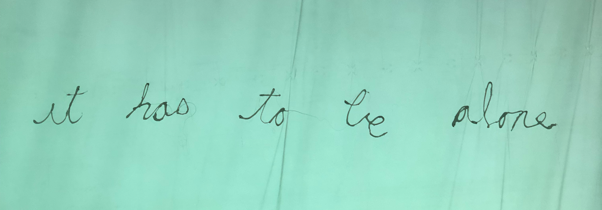
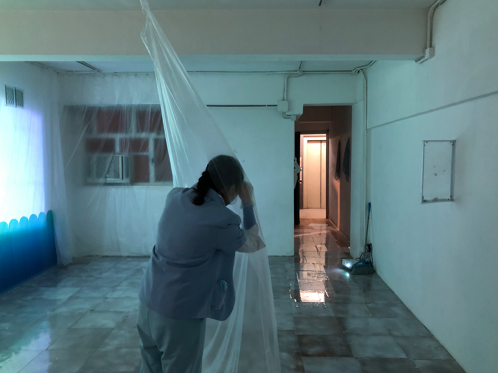
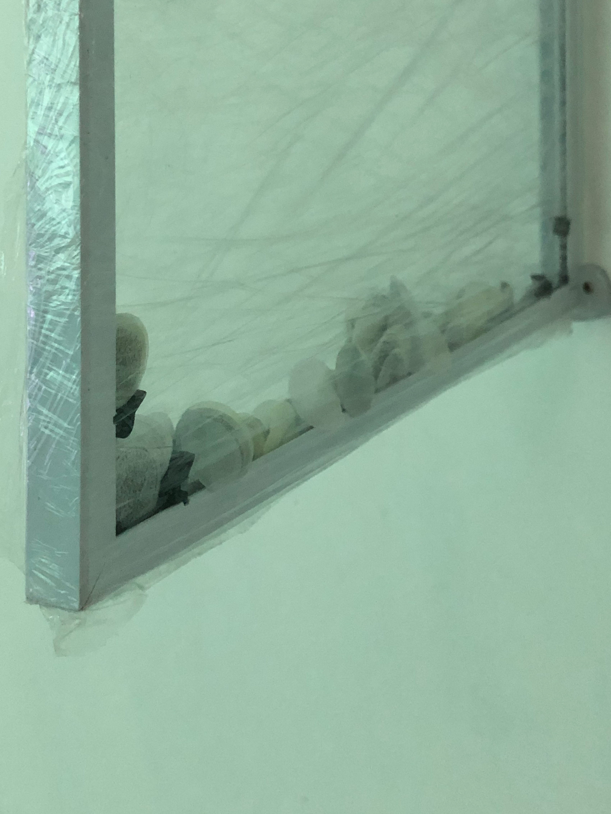
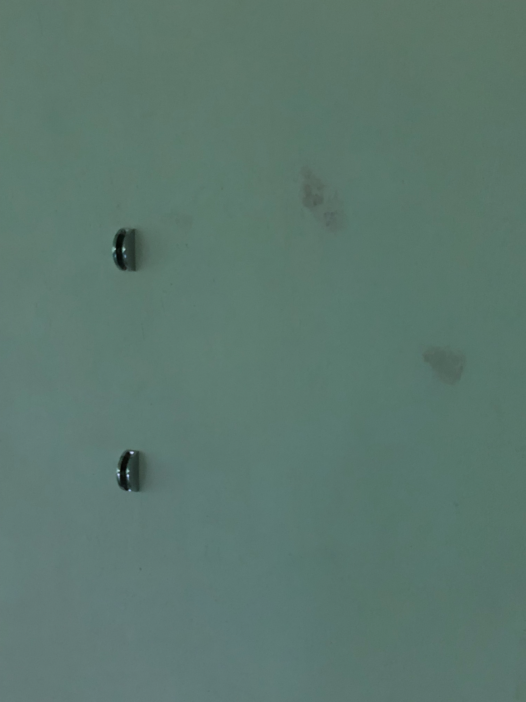
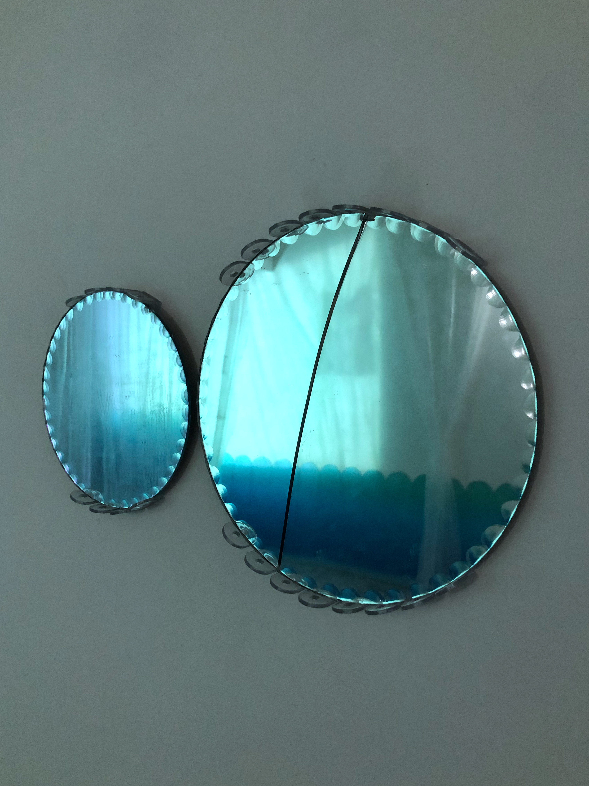
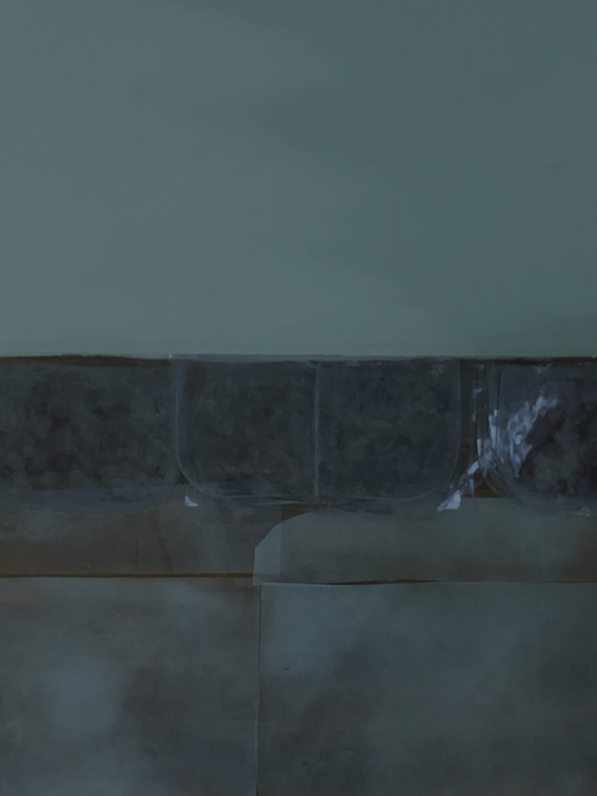
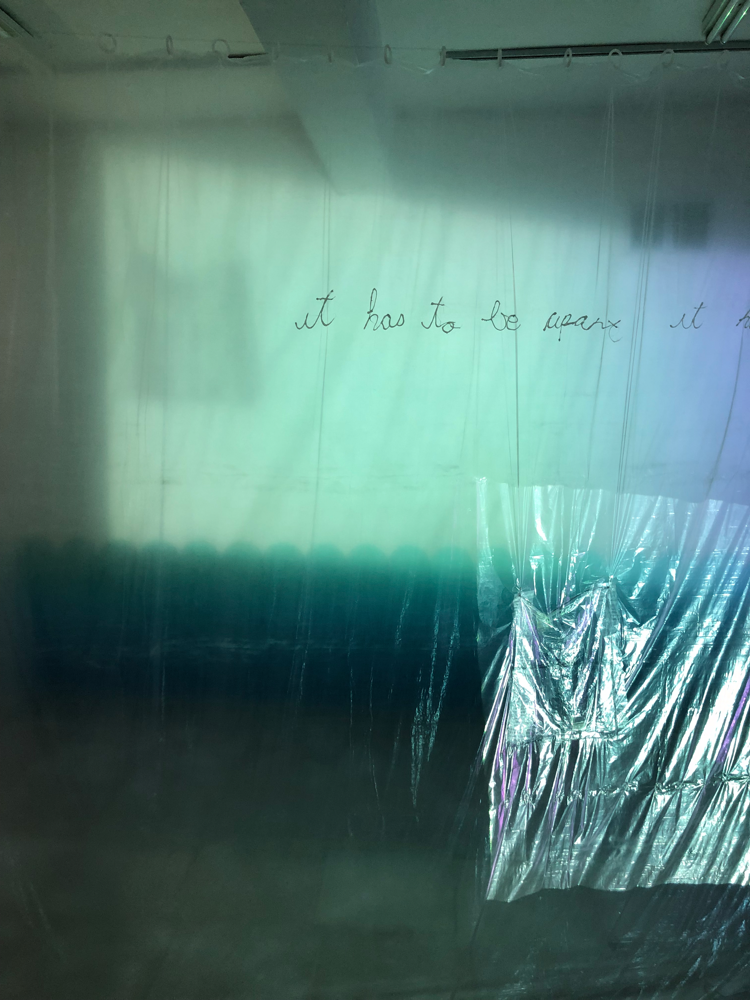
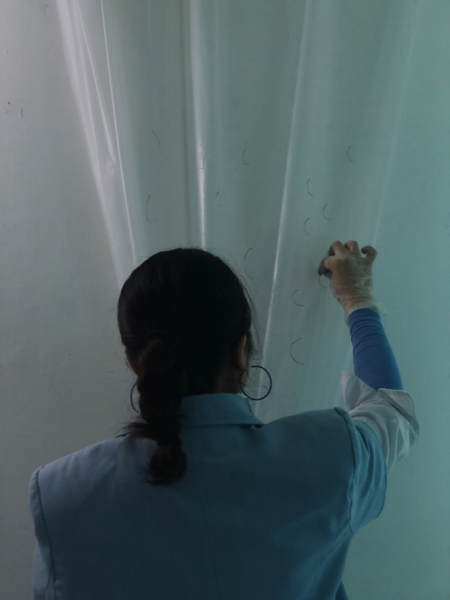
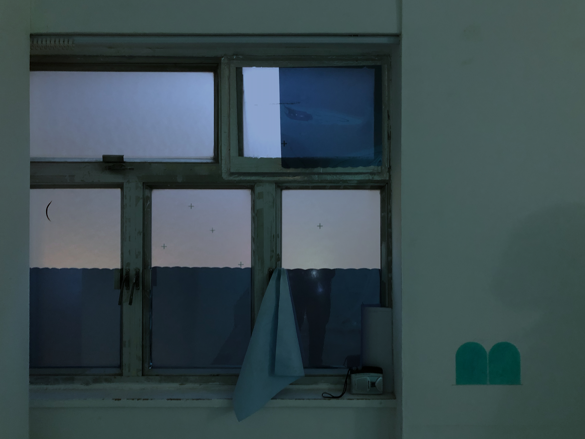

# seeing the inside of eyeballs

展覽 Exhibition :

It Has to Be ApartIt Has to Be Alone
藝術家 Artist :

Jessie Tam

地點 Venue :
ACO Art Space

日期 Date :

2023.02.01

## **// 從遇見它的那一刻我就知道它好想念舊屋，因為表面上的藍色水痕是它在哭的證據 //**

Jessie 首次回港的個人計劃－《It Has to Be ApartIt Has to Be Alone》（下稱《AA》），以她在漫遊時遇上像眼珠的石膏碎片為起點，配上展覽一系列的廢棄日常物創作，想像一個為石膏眼珠準備回到舊居的故事。

入門不久便遇上的英國香港小硬幣拓印，取材自 Jessie 到埗荷蘭進修後，發現兩顆偷偷跟著自己的硬幣。這樣的開始、廢屋的設置，加上 Jessie 與 Eyeball Maniac 的演出和獨白，觀眾不難發現這是一個關於過去、離家與回家的故事。計劃的另一部份－Struggling Artists, Special Edition Jan 2023 （展覽冊）中，亦有 Jessie 與藝術作者 MeMe 以不同文體和角度，闡述展覽中的「家」的文章，冊子的設計亦十分美觀，非常建議大家收藏一本（有意者請自行聯絡 Jessie ）。所以我想，不如我們來觀看一下展覽的其他部分吧。

## **// 如果哭是從眼晴裡來，我想我一早已經看到眼晴的裡面 //**

Jessie 將展覽空間打造成眼珠那間開半的舊居，讓理想的窗、白天、星星和黑夜都住進去。舊居同時是眼珠的裡面，邀請觀眾進入淺藍色的「淚」鏡。在冷色的房間中被一眾藍色和透明物包圍，膠膜、亞克力板和膠片正好重現眼在淚內，視覺被自身帶有極淺藍色的水份子包覆的感覺，並附帶水珠不規則的折射與皺痕。Jessie 以 Eyeball Maniac 的身份講述石膏眼珠的故事，她們仨的視覺在演出中連成一線，引領觀眾觀看作品和舊居。

演出後我問 Jessie 在石膏眼內有否看到甚麼，她說只有漆黑一片；的確，瞳孔的顏色早就告訴我們，眼珠內的世界是黑色的。

## **// I want the eyeballs see themselves cut in half //**

「一半」是展覽另一重要的 motif ，半晝半夜；半虛半實；半光半影，所有物件都在找尋它們的另一半。 Jessie 說她總覺得眼睛哭後會變成一大一小，而就在一大一小的圓鏡中，眼珠被割分兩半，一半在眼內，觀看著那另一半－那只有照鏡才會看見的自己。

Jessie 的創作媒介多得瘋狂，繪畫、影像、現成物、裝置、文本、表演、角色扮演、甚至日記，當中摻了大量個人經歷、記憶和秘密－《AA》中除了小硬幣的悄悄話，獨白中說給眼珠的月亮故事亦來自她一次在海上的回憶，清潔工的身份則來自在她在外地中餐館打工的經歷。Jessie 明言希望透過《AA》分享她與日常物的悄悄話，把這些秘密也說給觀眾知。

或許 Jessie 大部份作品也源於悄悄話：在《Be Friend OK？》（2019）中與鵝交友的「對話」，以及《Will You Pick Me Up Tomorrow》（2021）中扮演成藝術界各持份者的 MeMe 劇場，都以話語直白地說出了 Jessie 當下的思考和情感。《Will You Pick Me Up Tomorrow》中出現的角色－藝術作者 MeMe 亦在再次在《AA》展覽冊中，訪問為展覽主角 Eyeball Maniac 演出獨白的表演者 Jessie ，她如何呈現一個因自己偶遇到的拾遺物而想像／照見的世界。 Jessie 早就在玩這個不斷為自己建立第三身，然後觀看自己的遊戲，甚至為自己建立起自己的藝術論述。

## **// I did not ask you to come by, why did you? //**

正如 Jessie 自己亦提及，她習慣把 concept 記下，一點一點累積成創作。這些 concept 多半以短句的形式被保存和翻滾，若你翻開 Jessie 的  [@artwork_inventory_jessie_tam_](https://www.instagram.com/artwork_inventory_jessie_tam_/)  你可以找到她如何在 2019 起，在每次的創作中不斷累積並重現這些 motifs 和想像。它們在《AA》中成了 Household Fragments 的名字、成了 Eyeball Maniac 的獨白，亦在不同的文本中不斷被重組。它們像小硬幣般悄悄的出現到 Jessie 身旁， Jessie 則利用這些星星和月亮將地磚對齊和扣緊，卻又將他們當成塵，親手送他們離去，留空，讓塵又再次回來。打開展覽冊，你亦會發現他們悄悄地跟著，在你不為意時在你腦海回閃。

## **// to settle down, they cut themselves in half //**

《AA》沒有告訴我們眼珠看見舊居後的反應和去向，只知道 Eyeball Maniac 知道她一定會很傷心。 Eyeball Maniac 最後把尖刺的月亮掛在窗（投影）旁的窗簾，為眼珠說一個追尋月光的故事。《AA》不只是關於對舊居的不安，更總結了 Jessie 在外的經歷、秘語和藝術實踐（ art practice ）。與日記對半，展覽亦可以看作 Jessie 這幾年在文字以外的另一紀錄。

